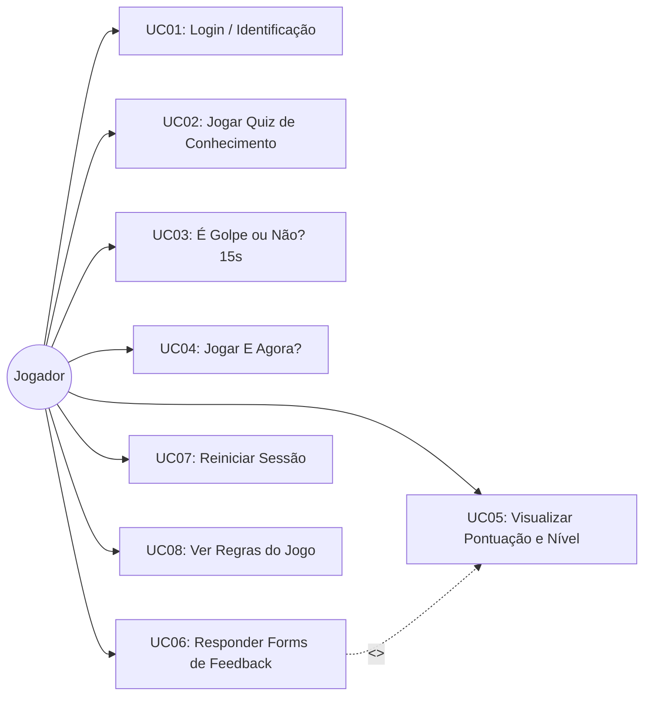
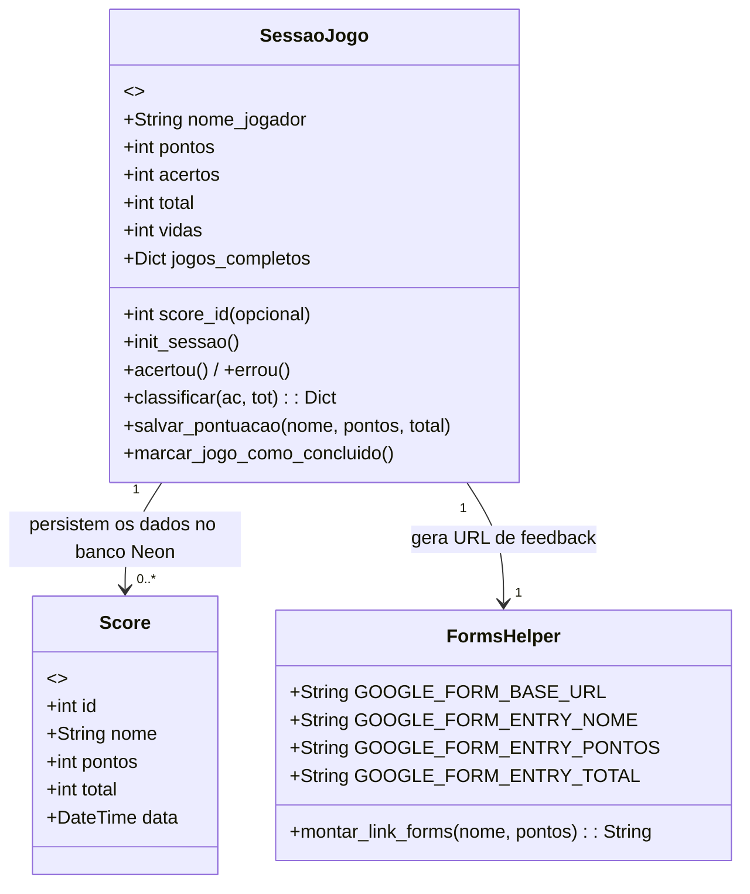

# Desconfia!

🎮 **Acesse e jogue agora:** [https://desconfia-jogo.onrender.com](https://desconfia-jogo.onrender.com)

---

Um jogo educativo sobre segurança digital, golpes, vírus e notícias falsas, focado no público adulto.

O jogador vivencia três modos dinâmicos e recebe explicações detalhadas a cada resposta. Mais do que apenas testar o aprendizado, o objetivo principal é ensinar os motivos por trás de cada situação. 
Por isso, a plataforma não exibe um ranking competitivo, o foco é o aprendizado individual e a conscientização.

---

## Como funciona

**Quiz** - 15 perguntas sorteadas de um banco com 20. Quatro alternativas, uma certa.

**É Golpe ou Não?** - uma mensagem aparece (SMS, WhatsApp, e-mail, etc) e o jogador tem 15 segundos para decidir se é golpe ou legitimo.

**E Agora?** - situações onde o problema já aconteceu. O foco é na ação certa depois do golpe.

Em todos os jogos: cada acerto vale 10 pontos, o jogador tem 3 vidas e recebe uma explicação independente de acertar ou errar.

Cada jogador (identificado por nome no login) pode jogar **cada um dos 3 jogos apenas uma vez por sessão**, para assim manter a experiência de aprendizado consistente e justa. 
Após concluído o jogo, o jogo aparece marcado como "Já jogado" no menu. 
O jogador pode reiniciar o próprio progresso a qualquer momento pelo botão **[X]** no menu escolhendo reiniciar e colocando novo nome.

**Classificação ao final:**

| Aproveitamento | Resultado |
|----------------|-----------|
| até 40%        | Isca      |
| 41% a 70%      | Atento    |
| 71% a 90%      | Blindado  |
| acima de 90%   | Perito    |

---

## Tecnologias

- Python + Flask (backend)
- Sessão do jogador armazenada no banco de dados (Flask-Session + SQLAlchemy), usando a mesma conexão SQL (Neon) da aplicação
- Flask-SQLAlchemy + PostgreSQL (Neon) em produção, com fallback para SQLite local em desenvolvimento
- HTML (Jinja2), CSS e JavaScript puro (frontend)
- Dados das perguntas/situacoes em JSON, separados da lógica para facilmente ir incrementando (escalonável)

---

## Requisitos de Sistema

### Requisitos Funcionais (RF)
| ID | Nome | Descrição |
|----|------|-----------|
| RF01 | Identificação simples | Permite a entrada do jogador apenas com o primeiro nome para controle de sessão, sem necessidade de senha ou cadastro complexo. |
| RF02 | Módulos gamificados | Disponibiliza 3 modalidades independentes de jogo: Quiz de Conhecimento, É Golpe ou Não? e E Agora? |
| RF03 | Temporizador de urgência | Aplica contagem regressiva de 15 segundos nas questões de decisão rápida (Jogo 2), registrando tempo esgotado como erro. |
| RF04 | Gestão de vidas e pontuação | Soma 10 pontos por acerto, gerencia o limite de 3 vidas por partida e redireciona para Game Over caso as vidas se esgotem. |
| RF05 | Persistência no banco de dados | Salva automaticamente nome, pontuação final, total de perguntas e data/hora no banco PostgreSQL. |
| RF06 | Classificação de vulnerabilidade | Calcula a porcentagem de acertos e classifica o jogador em 4 perfis: Isca, Atento, Blindado ou Perito. |
| RF07 | Formulário condicional de feedback | Libera dinamicamente o botão de acesso ao Google Forms no menu principal apenas após a conclusão dos 3 jogos, preenchendo automaticamente nome e pontuação na URL. |
| RF08 | Carregamento dinâmico em JSON | Mantém o acervo de perguntas e explicativos desacoplado da lógica da aplicação. |

### Requisitos Não Funcionais (RNF)
| ID | Nome | Descrição |
|----|------|-----------|
| RNF01 | Segurança e arquitetura cliente-servidor | Isola a regra de negócios no servidor Flask, ocultando variáveis de ambiente sensíveis (`DATABASE_URL`) e prevenindo manipulação de pontos via navegador. |
| RNF02 | Usabilidade e acessibilidade | Interface responsiva retro-pixel em alto contraste, adaptada para fácil visualização e toque em smartphones por adultos e idosos. |
| RNF03 | Conformidade com a LGPD | Não solicita nem armazena dados pessoais sensíveis (como CPF, e-mail, sobrenome ou telefone). |
| RNF04 | Disponibilidade | Mantém a aplicação online na plataforma Render conectada ao banco Neon DB, com tempo de resposta inferior a 2 segundos. |
| RNF05 | Escalabilidade | Permite inclusão de novos golpes digitais nos arquivos JSON sem necessidade de refatorar o código-fonte em Python. |
---

## Diagrama de Casos de Uso (UML)


## Diagrama de Classes
Estrutura conceitual da sessãoJogo Flask, não é uma classe Python real, mas sim umma abstração, uma representação visual


---

## Como rodar localmente

Precisa ter Python 3.8 ou superior instalado.

```bash
# clona o repositorio
git clone https://github.com/anelize-borges/game-python.git
cd game-python

# instala as dependências
pip install -r requirements.txt
# SECRET_KEY - chave de sessão (se não definida, usa uma padrão de desenvolvimento)
# DATABASE_URL - se não definida, usa SQLite local (scores.db)

# roda o servidor
python applicativo.py
```
Acessa no navegador: `http://localhost:5000`

---

## Como colocar no ar (deploy gratuito)

### Neon (banco de dados em produção)
1. Cria conta em [neon.tech](https://neon.tech)
2. Cria um projeto (isso já gera um branch/banco padrão)
3. Copia a connection string em **Connection Details**
4. Usa essa string como valor de `DATABASE_URL` no Render (próximo passo)

### Render (para jogar de verdade)

1. Cria conta em [render.com](https://render.com)
2. Clica em **New > Web Service**
3. Conecta com o GitHub e escolhe esse repositorio
4. Preenche assim:
   - **Build Command:** `pip install -r requirements.txt`
   - **Start Command:** `gunicorn applicativo:app`
   - **Environment:** Python 3
5. Na aba **Environment**, adiciona as variáveis:
   - DATABASE_URL: a connection string copiada do Neon
   - SECRET_KEY: uma chave aleatória forte (gera com `python -c "import secrets; print(secrets.token_hex(32))"`)
6. Clica em **Deploy**

Pronto. O Render gera um link publico que qualquer pessoa acessa no navegador, sem instalar nada.

> O plano gratuito do Render hiberna após 15 minutos sem uso. A primeira visita pode demorar uns 30 segundos para acordar o servidor.

### GitHub (apenas para consulta do codigo)

O repositorio também pode ser publicado no GitHub Pages, mas **so como vitrine do codigo-fonte** 
O GitHub Pages hospeda apenas arquivos estaticos (HTML/CSS/JS) e não executa aplicacoes Python/Flask no servidor. 
Ou seja, o jogo em si **não roda** por ali; quem quiser jogar de verdade deve usar o link gerado pelo Render.

---

## Estrutura do projeto

```
game-python/
|-- applicativo.py         # servidor Flask: rotas, sessao, banco de dados
|-- requirements.txt       # flask, flask-sqlalchemy, flask-session, gunicorn, psycopg2-binary
|-- scores.db              # banco SQLite local (se em dev); em producao usa Postgres (Neon) por DATABASE_URL
|-- quiz.json              # banco de 20 perguntas
|-- mensagens.json         # cenarios para o jogo "Golpe ou Nao?"
|-- situacoes.json         # situacoes para o jogo "E Agora?"
|-- templates/
|   |-- base.html          # layout base (janela estilo retro, titlebar)
|   |-- login.html         # tela inicial, jogador digita o nome
|   |-- menu.html          # menu principal com status "Ja Jogado" e botao [X]
|   |-- quiz.html          # tela do jogo Quiz
|   |-- golpe.html         # tela do jogo Golpe ou Nao (com temporizador)
|   |-- agora.html         # tela do jogo E Agora?
|   |-- avaliacao.html     # feedback apos cada resposta
|   |-- resultados.html    # resultado final de cada jogo
|   |-- pontos.html        # pontuacao acumulada da sessao
|   `-- regras.html        # as 8 regras de ouro
`-- static/
    |-- stylesheet.css     # visual retro com tema escuro
    |-- menu.js            # logica do modal do botao [X] (reiniciar / sair) + esconder botão forms após clique (1uso)
    `-- temporizador.js    # contagem regressiva do jogo "Golpe ou Nao?"
```

Para adicionar novas perguntas, é só editar os arquivos JSON. Não precisa mexer no código!

---

## Fontes do conteúdo

- Banco Central do Brasil (informações sobre Pix e MED)
- CERT.br / NIC.br (Cartilha de Segurança para Internet)
- Febraban (golpes por telefone e spoofing)
- SaferNet Brasil
- Agencia Lupa e Aos Fatos (checagem de fatos)